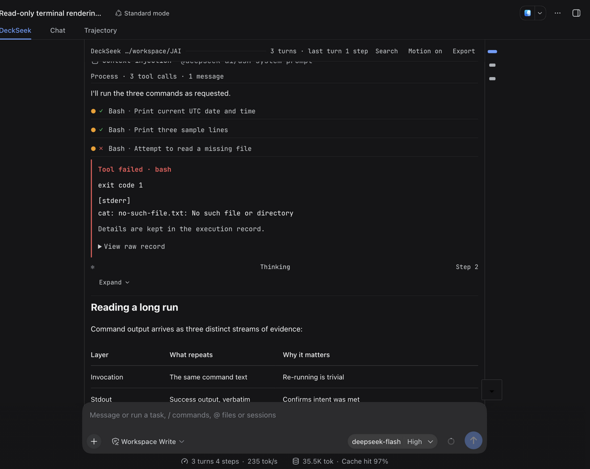

# dsh-deckseek

[English](./README.en.md) | [中文](./README.md)

[](https://awesome-dsh-plugin.com)

> 🙏 Thanks to the original repository [aa2246740/dsh-better-display](https://github.com/aa2246740/dsh-better-display) (MIT) and its authors and contributors.

dsh-deckseek is a fork of [aa2246740/dsh-better-display](https://github.com/aa2246740/dsh-better-display), independently maintained by [JNNarrator](https://github.com/JNNarrator) as a DeepSeek Harness display & interaction enhancement plugin (MIT).

It adds an independent **DeckSeek reading tab** to DSH: the execution record folds away, the final answer stays in full, and three reading skins are available. It changes **presentation and interaction views only** — the native Chat / Trajectory tabs, composer, model selector, tools, and approvals all stay exactly as they are.

## Screenshots


**The DeckSeek reading view** (Soft skin, the default): the execution record folds away and the final answer renders in full — headings, tables, code, formulas and quotes in one column; the toolbar stays pinned at the top (readout plus search / motion / export); the message rail hugs the right edge; spacing above the task bar and composer stays compact — no hollow gaps under long task lists.



**The Terminal skin**: a pinned window bar carrying the readout (`3 turns · last turn 1 step`), a full-width band for your own message behind a `> ` prompt, one glyph vocabulary for the whole skin (`⏺ ⎿ ✻`), a per-turn working verb and a breathing dot. Three skins (**Paper** typographic flow / **Soft** cards / **Terminal** rows) share one DOM and change only structure, density and type; colours always come from host theme tokens, so light and dark adapt on their own.

| Message navigation rail | In-view search |
|---|---|
|  |  |
| Hovering a mark shows a "Turn N · title" info bubble; clicking scrolls the message into view with a landing flash | Live match counts with previous / next navigation; hits scroll precisely into view with a flash |
| **Execution process & tool rows** | **Unified failure cards** |
|  |  |
| A folded turn states what it hides (`3 tool calls · 1 failed`), and expanding it labels each row by family (Ran / Failed…); thinking cards expand | Failure reason, exit code and stderr summary, plus an expandable raw record |

## Three reading skins

Switch from the dedicated **DeckSeek** page in DSH settings; it takes effect immediately, and **Soft** is the default.

| Skin | Direction | Good for |
|---|---|---|
| **Soft** (default) | Cards: the answer card uses the host's own elevation (0.5px hairline stroke + soft glow), and the user card derives an identity colour from the brand accent | Everyday reading; clear separation between turns |
| **Paper** | Typographic flow: no containers at all, only a heading hierarchy and article-scale prose rhythm; colour is reserved for failures | Long-form reading, export and print |
| **Terminal** | Rows: monospace, a window frame with a title bar, hairline row rules, and state / tool-category colour as the only colour | TUI and Claude Code sensibilities |

Skins express structure, density, type, and radii only; **every colour comes from a host theme token**, so dark and light themes adapt automatically and the plugin ships no palette of its own. Switching skins does not change the component tree — one DOM, a different stylesheet; see [docs/design/reading-skins.md](docs/design/reading-skins.md).

The terminal skin adds a window title bar (workspace path plus a standing `N turns · last turn N steps` readout), a `▌` caret on the streaming answer, a breathing dot with a per-turn verb and a right-aligned clock in the status line, tool-category colour on the `⏺` marker, a right-aligned number column, a count of what a folded turn hides (`39 tool calls · 4 files · 2 failed`), a hanging hairline on the closing readout line, a full-width band for the user turn, and a braille dot-matrix mark on the idle screen. The reasoning behind each, with measured parameters, is in [docs/design/terminal-skin-v3.md](docs/design/terminal-skin-v3.md) and [terminal-skin-v4.md](docs/design/terminal-skin-v4.md).

## Features

**Reading view**

- Live native steps, thinking, and progress during execution; the process folds away on successful completion, leaving the final answer and interactive cards.
- Every known record kind (system prompts, turn processes, turn stats, …) is adapted; **unknown kinds fall back to a copyable raw-record card** — DSH is not stable yet, so the fallback stays.
- Failed tools / commands render as unified error cards: reason, exit code, and an expandable raw record.
- Long reasoning folds into a fading two-line card that follows along; expanding pauses the follow, which can be resumed.
- **Lossless fidelity**: native Markdown, syntax highlighting, math, tables, images, and tool facts render exactly.

**Navigation & search**

- **Message navigation rail**: a minimal right-edge rail of tiny pill marks — one per message you sent, editor-minimap style. It takes no layout space and the reading column stays truly centered; the mark at your reading position widens and highlights, hovering shows a "Turn N · title" info bubble, and clicking scrolls that message into view with a landing flash. Marks compress to fit when turns pile up, so every mark stays visible (hidden on narrow widths).
- **Turn keyboard navigation**: `Alt+↑` / `Alt+↓` jump between your messages using the same positioning logic as the rail.
- **In-view search**: covers your questions and the model's answers; live match counts, previous / next navigation, precise scrolling to each hit with a flash; every match block is tinted, character-level hits are painted through the CSS Custom Highlight API, and the current hit is inverted for emphasis.
- **Reading position memory**: reopening a session returns to where you stopped, with a brief notice; "Back to latest" jumps to the end at any time.

**Export & copy**

- **Session export**: one click in the reading toolbar downloads the session as Markdown (your questions plus the model's answers in display order, process folded), with a timestamped filename.
- One-click copy on code blocks; hovering a table in an answer reveals "Copy as CSV" (RFC 4180, quotes and newlines handled).

**Interaction & state**

- **Status and follow**: the reasoning card follows the latest line and rests at the bottom when it ends; while thinking it shows a localized "thinking… {time}" label, and tools show per-family states; scrolling away from the bottom reveals a ⬇ button above the composer; sending or steering a message returns the view to the bottom.
- **Motion can be turned off**: the toolbar toggle or the system's `prefers-reduced-motion` stops every animation from one place.
- **Bilingual UI**: every reading-view string follows the DSH app language (Chinese / English) with no restart.
- **Adaptive theme and type size**: dark / light syncs live with no flash; type follows browser zoom and the host's content font-size setting (skin line heights, leading slots, and block gaps follow it too).

**Compatibility**

- **Generative MCP Apps (SEP-1865)**: an ````mcp-app```` code block in a reply mounts as a live interactive card inside a `sandbox="allow-scripts allow-forms"` iframe, talking over JSON-RPC `postMessage` (`ui/initialize`, `ui/resize`, `ui/submit`, …), with the card height adapting between 60 and 2400px.
- **157 unit and component tests**: covering message projection, the Markdown pipeline, SEP-1865 parsing, adaptive height budgeting, two-line streaming follow, and the search / copy / skin-part / caret-hook / stylesheet-contract interactions (colours come from host tokens only, every token reference resolves, every drawn glyph is one cell wide) under happy-dom.

## Keyboard shortcuts

| Key | Action |
|---|---|
| `Alt+↑` / `Alt+↓` | Jump between your messages (inactive while typing in a field) |
| `Cmd/Ctrl+F` | Open / close in-view search |
| `Enter` / `Shift+Enter` | In search: next / previous match |
| `Esc` | Close search |
| `←` `→` `Home` `End` | Switch tabs inside a tool card |

## Installation

There are two release channels and **they are not in sync**: npm currently carries **0.6.0**, while newer versions ship as GitHub Release tarballs (this repository is at **0.10.1**).

```sh
# From npm (0.6.0)
dsh plugin --profile web add dsh-deckseek

# Or install the newest release from its tarball
dsh plugin --profile web add ./dsh-deckseek-0.10.1.tgz
```

`--profile` takes `web`, `desktop`, or `headless` depending on the host you run. Restart the host after installing.

Listed in:

- [awesome-dsh-plugin](https://github.com/awesome-dsh-plugin/awesome-dsh-plugin) (PR [#4528](https://github.com/awesome-dsh-plugin/awesome-dsh-plugin/pull/4528), merged)
- [awesome-deepseek-harness-plugins](https://github.com/imsai-sh/awesome-deepseek-harness-plugins) ([deepseek1024.com](https://deepseek1024.com/), PR [#367](https://github.com/imsai-sh/awesome-deepseek-harness-plugins/pull/367), merged; once the npm package is published the marketplace detects it and upgrades to one-click install)

## Development

```sh
npm test                                  # 157 tests (node --test + happy-dom)
npx tsc -p tsconfig.json --noEmit         # type check
DSHX_HARNESS=<DSH checkout> npm run build # build lib/ (client + host halves)
```

- **Dependencies come from a DSH checkout, not npm**: link development dependencies to a built Harness checkout with `node scripts/link-harness-dependencies.mjs <DSH checkout>`; do not run `pnpm install` / `pnpm add` in this directory.
- **`package-lock.json` is a best-effort artifact under `--legacy-peer-deps` semantics**: the published `@deepseek-ai/dsh-client-ui-settings` declares a `^0.0.1-rc.1` peer on `@deepseek-ai/dsh-client-ui-primitives`, which cannot intersect this plugin's 0.1.x range, so strict resolution always ends in ERESOLVE.
- Do **not** run `npm ci` here — it cannot reproduce a working dependency tree.
- When verifying a new build locally: with a profile pointing at a tarball through `file:`, re-running `dsh plugin --profile web install` after rebuilding that tarball does **not** update it (it reports `Already up to date`). Remove `<profile>/node_modules/dsh-deckseek`, run `dsh plugin --profile web install --force`, then compare `lib/client.js` byte for byte.

## Other

- Features and usage are also documented by the original repository: [aa2246740/dsh-better-display](https://github.com/aa2246740/dsh-better-display)
- Third-party notices: [THIRD_PARTY_NOTICES.md](THIRD_PARTY_NOTICES.md) · Changelog: [CHANGELOG.md](CHANGELOG.md) · Design contract: [DESIGN.md](DESIGN.md) · Design docs: [docs/design/](docs/design/)

**v0.10.1 · An unofficial DSH display & interaction enhancement plugin. It only changes presentation and interaction views — never the Agent's core execution, SDK, or model credentials.**
