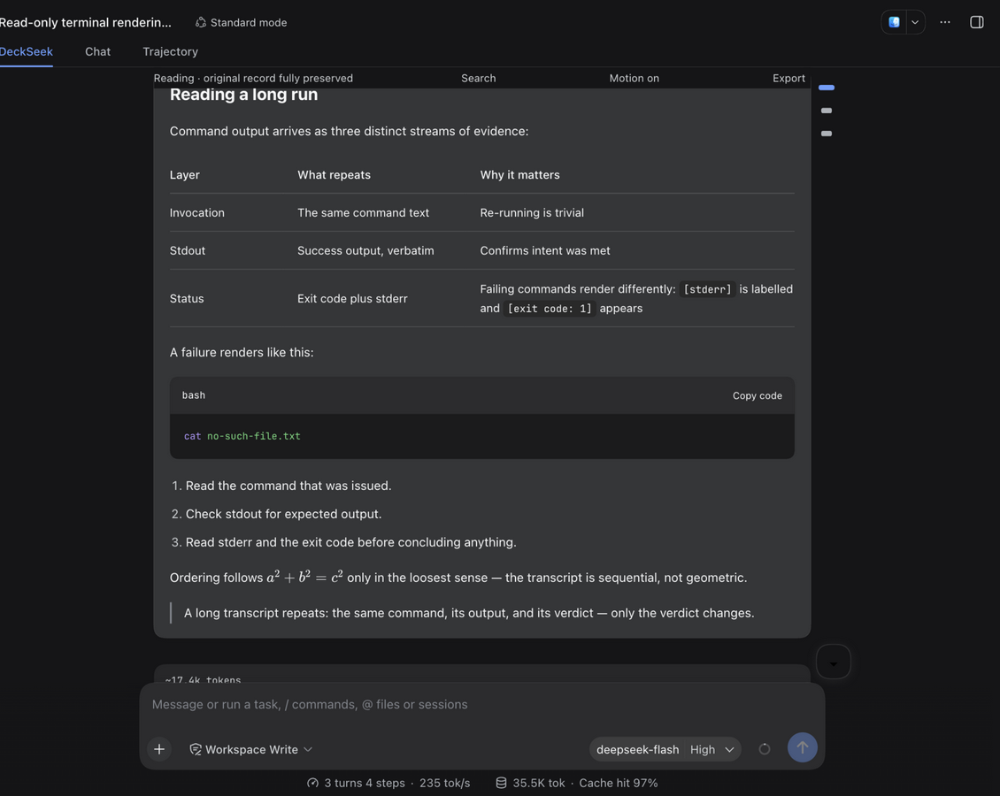
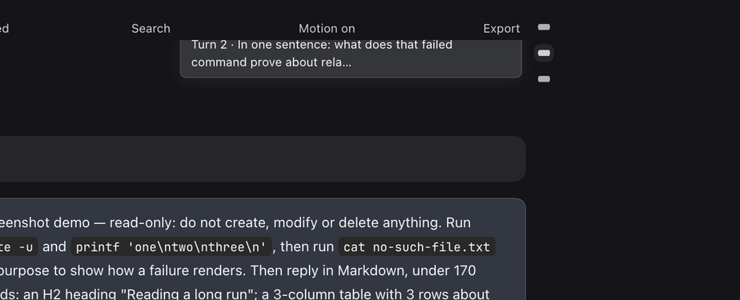
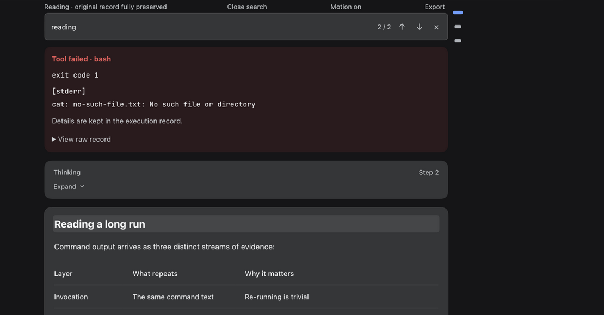
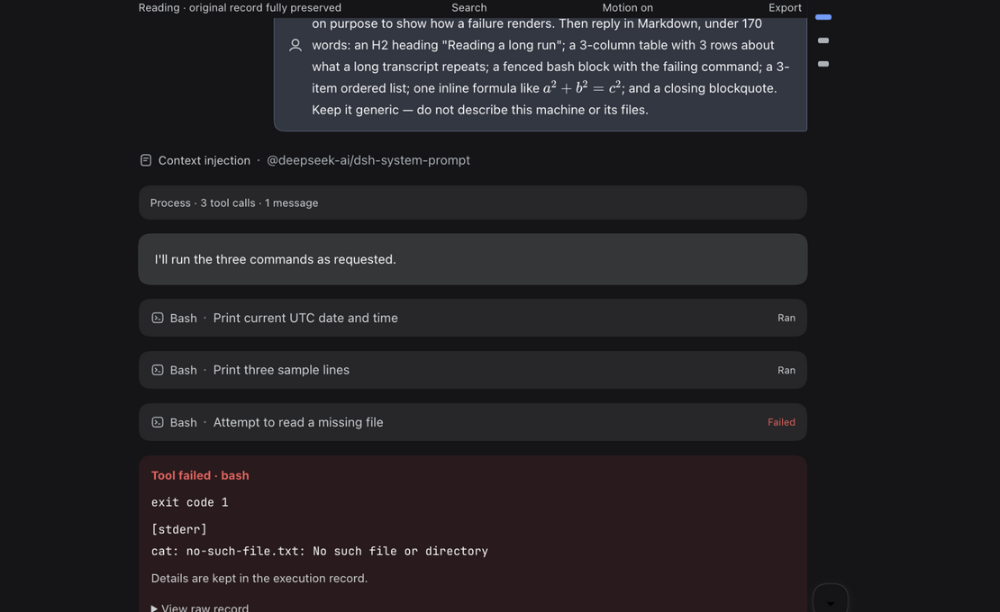
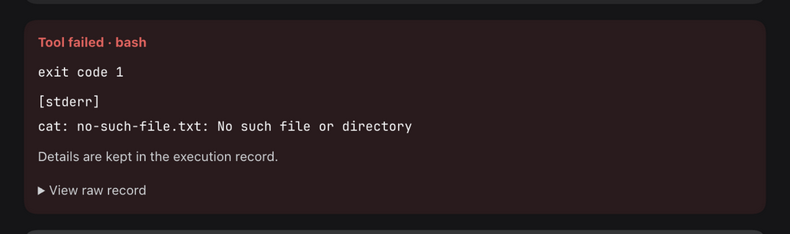

# dsh-deckseek

[English](./README.en.md) | [中文](./README.md)

[](https://awesome-dsh-plugin.com)

> 🙏 鸣谢原仓库 [aa2246740/dsh-better-display](https://github.com/aa2246740/dsh-better-display)（MIT）及其作者与贡献者。

dsh-deckseek 是 [aa2246740/dsh-better-display](https://github.com/aa2246740/dsh-better-display) 的 fork，由 [JNNarrator](https://github.com/JNNarrator) 独立维护的 DeepSeek Harness 展示与交互增强插件（MIT）。

## 界面预览



**DeckSeek 阅读视图**：执行过程自动折叠、最终回答完整呈现；右缘消息导航气泡贴附；任务栏与输入框之上留白紧凑，不再被长任务列表撑出大片空白。

| 消息导航导轨 | 页内查找 |
|---|---|
|  |  |
| 悬停气泡显示「第 N 轮 · 标题」，点击平滑跳转并闪烁标记落点，当前阅读位置自动加宽高亮 | 实时匹配计数、上/下跳转，命中精确滚动定位并闪烁高亮 |
| **执行过程与工具行** | **统一失败卡片** |
|  |  |
| Write/Edit 行显示 +N -M 变更统计与分类状态标签（已写入 / 已找到…），思考卡片可滚动、可展开 | 失败原因、退出码与可展开的原始记录，重试提示共用同一文案 |

## 功能特性

- **阅读视图**：执行中实时呈现原生步骤、思考与进度；任务成功后自动收起过程，保留最终回答与交互卡片。独立的 **DeckSeek** 页签，原「对话 / 轨迹」、输入框、模型选择、工具与审批均完整保留。全部已知记录类型（系统提示词、执行过程、轮次统计等）均已适配，未知类型自动回退为可复制的原始记录卡片——DSH 尚未稳定，兜底始终保留。工具 / 命令失败以统一错误卡片呈现：失败原因、退出码与可展开的原始记录。
- **回答卡片**：回答正文与复制按钮收进与思考卡/工具卡同语言的卡片容器；复制按钮悬浮于卡片右上角（悬停浮现），回答区保持满密度。
- **三套阅读皮肤**：纸面（排版流）、软卡（卡片）、终端（行列）三套皮肤，在 DSH 设置的独立 **DeckSeek** 页里切换、即时生效；皮肤只表达结构、密度、字体与圆角，颜色全部取自宿主主题 token，亮暗主题自动适配，默认为软卡。
- **消息导航导轨**：右缘最小化气泡导轨（编辑器 minimap 风格）——每条你发送的消息对应一颗小刻度，不占布局空间、会话栏保持居中；当前阅读位置的刻度自动加宽高亮，悬停显示「第 N 轮 · 标题」信息气泡，点击平滑跳转并以蓝色描边闪烁标记落点（贴底时最新消息自动获得高亮，窄屏自动隐藏）。回合多时刻度自动压缩排布，始终全部可见。
- **状态与跟随**：思考卡片紧跟最新并在结束后停在底部；正在思考时显示「大肥鱼正在思考中… 用时」，工具按类别显示阅读中/已阅读、搜索中/已找到等中英文状态；滚动离开底部时底部中央出现悬于输入框上方的 ⬇ 到底部按钮；发送或插话消息后阅读视图自动跳回底部（贴底跟随接管）。
- **阅读页查找**：在阅读页内实时查找关键词，覆盖你的问题与模型回答；Cmd/Ctrl+F 直达，匹配计数、上 / 下跳转，命中精确滚动定位并闪烁高亮；所有匹配块淡底标记，字符级出现位置经 CSS Custom Highlight API 精确染色、当前命中反白加强。
- **会话阅读位置记忆**：再次打开会话自动回到上次阅读位置，附短暂提示；「回到最新」随时可跳回底部。
- **复制增强**：代码块一键复制；回答中的表格悬停即见「复制为 CSV」（RFC 4180，自动处理引号与换行）。
- **双语 UI（i18n）**：全部阅读页文案随 DSH 应用语言切换（中文 / English），无需重启。
- **长思考跟随**：思考过程折叠为淡出卡片并两行跟随，展开即暂停滚动，可手动恢复。
- **生成式 MCP Apps（SEP-1865）**：模型在回答中输出 ````mcp-app```` 代码块即自动挂载为活体交互卡片，在 `sandbox="allow-scripts allow-forms"` 沙箱 iframe 中运行，通过 JSON-RPC `postMessage` 双向通信（`ui/initialize`、`ui/resize`、`ui/submit` 等）。
- **自适应主题、高度与字号**：深浅色实时同步、零闪烁；容器高度 60–2400px 随内容平滑伸缩；全量 rem 字号跟随浏览器 / 宿主字号缩放。
- **无损保真**：原生 Markdown、代码高亮、数学公式、表格、图片与工具事实 100% 忠实呈现。
- **94 项单元与组件测试**：覆盖消息投影、Markdown 管道、SEP-1865 解析、自适应高度预算、两行流式跟随，以及搜索定位、复制回执等界面交互（happy-dom）。

## 安装与收录

已发布至 npm：[dsh-deckseek](https://www.npmjs.com/package/dsh-deckseek)

```sh
dsh plugin add dsh-deckseek
```

已收录于：

- [awesome-dsh-plugin](https://github.com/awesome-dsh-plugin/awesome-dsh-plugin)（PR [#4528](https://github.com/awesome-dsh-plugin/awesome-dsh-plugin/pull/4528) 已合并）
- [awesome-deepseek-harness-plugins](https://github.com/imsai-sh/awesome-deepseek-harness-plugins)（[deepseek1024.com](https://deepseek1024.com/)，PR [#367](https://github.com/imsai-sh/awesome-deepseek-harness-plugins/pull/367) 已合并；npm 包已发布，市场检测到后自动升级为一键安装）

## 开发

- **依赖来自 DSH 检出，而非 npm**：开发依赖通过 `node scripts/link-harness-dependencies.mjs <DSH 检出路径>` 以符号链接接入一个已构建的 Harness 检出，不要在本目录执行 `pnpm install` / `pnpm add`。
- **`package-lock.json` 是 `--legacy-peer-deps` 语义下的尽力而为产物**：已发布的 `@deepseek-ai/dsh-client-ui-settings` 对 `@deepseek-ai/dsh-client-ui-primitives` 声明了 `^0.0.1-rc.1` peer，与本插件 0.1.x 区间无法相交，严格解析必然 ERESOLVE。
- 因此**不要在本目录运行 `npm ci`**——它无法复现可用的依赖树。

## 其他

- 功能与使用说明亦可参考原仓库：[aa2246740/dsh-better-display](https://github.com/aa2246740/dsh-better-display)
- 第三方声明：[THIRD_PARTY_NOTICES.md](THIRD_PARTY_NOTICES.md) · 变更记录：[CHANGELOG.md](CHANGELOG.md) · 设计契约：[DESIGN.md](DESIGN.md)

**v0.7.3 · 非官方 DSH 展示与交互增强插件。只改展示与交互视图，不改 Agent 核心执行逻辑、SDK 或模型凭据。**
